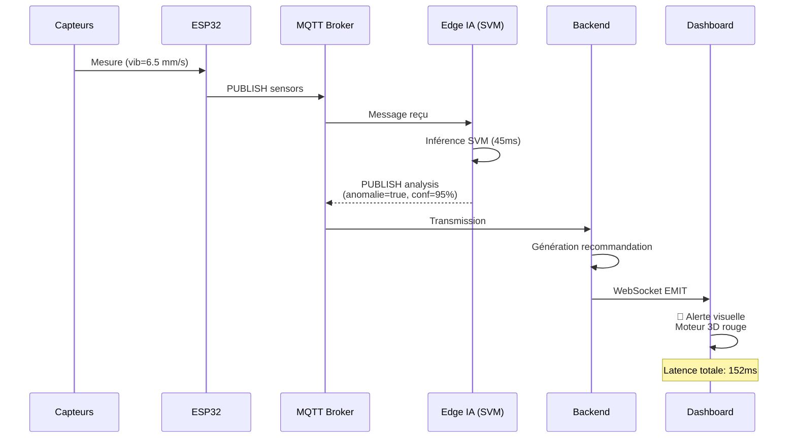
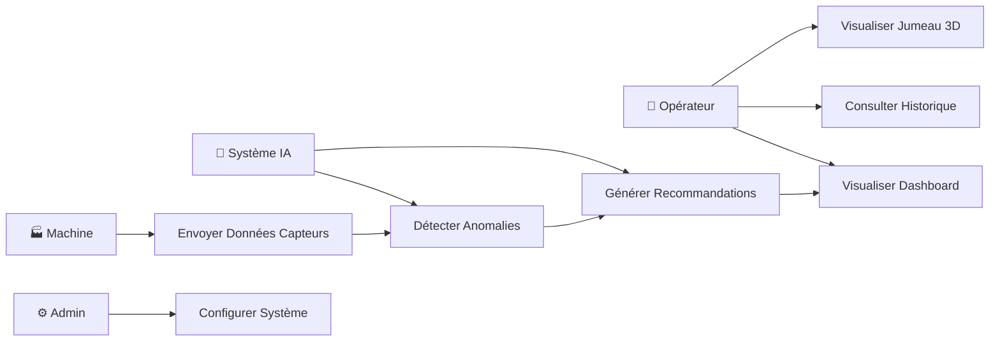
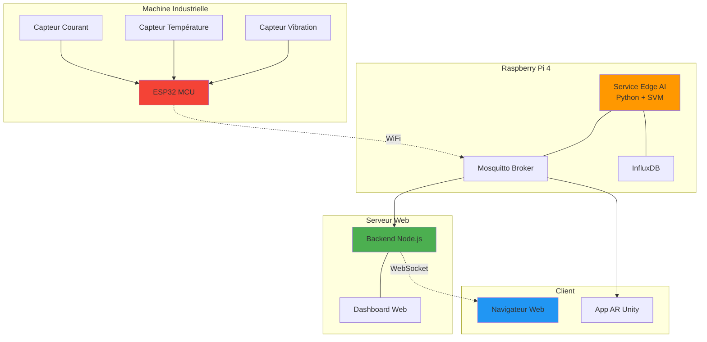

# 🏭 Plateforme IoT de Maintenance Prédictive avec Intelligence Artificielle

<div align="center">


*Surveillance intelligente de machines industrielles en temps réel avec détection d'anomalies par IA distribuée*

[🎯 Démo](#demo) • [📖 Documentation](#documentation) • [🚀 Installation](#installation) • [🏗️ Architecture](#architecture)

</div>

---

## 📋 Table des Matières

- [Présentation](#présentation)
- [Architecture du Système](#architecture)
- [Technologies Utilisées](#technologies)
- [Installation et Démarrage](#installation)
- [Résultats](#résultats)
- [Diagrammes UML](#diagrammes-uml)

---

## 🎯 Présentation

Ce projet implémente une solution complète de **Maintenance Prédictive 4.0** permettant de :

- 📊 **Surveiller** en temps réel l'état de santé des machines industrielles (vibration, température, courant)
- 🧠 **Détecter** automatiquement les anomalies via un modèle IA (SVM) déployé en Edge Computing
- ⚡ **Alerter** instantanément les opérateurs avec des recommandations techniques précises
- 📈 **Visualiser** les données sur un dashboard web 3D interactif
- 🔄 **Éviter** les pannes coûteuses grâce à une intervention au bon moment

### 🌟 Points forts

✅ **Edge AI** : Intelligence artificielle déployée localement (Raspberry Pi) pour une latence < 100ms  
✅ **Architecture IoT** : Communication MQTT légère et scalable  
✅ **Jumeau Numérique 3D** : Visualisation immersive en temps réel (Three.js + Unity)  
✅ **IA Cognitive** : Recommandations textuelles générées automatiquement  
✅ **Dashboard Pro** : Interface Dark Mode avec graphiques temps réel

---

## 🏗️ Architecture du Système {#architecture}

### Vue d'Ensemble en Couches

```mermaid
graph TB
    subgraph "Couche Visualisation"
        A[Dashboard Web 3D]
        B[Application AR Mobile]
        C[Grafana]
    end
    
    subgraph "Couche Application"
        D[Backend Node.js<br/>Express + Socket.io]
    end
    
    subgraph "Couche Edge Computing"
        E[Raspberry Pi<br/>SVM Model<br/>Inférence temps réel]
        F[InfluxDB<br/>Séries Temporelles]
    end
    
    subgraph "Couche Communication"
        G[Mosquitto MQTT Broker<br/>QoS 1]
    end
    
    subgraph "Couche IoT"
        H[ESP32 + Capteurs<br/>Vibration | Température | Courant]
    end
    
    A --> D
    B --> D
    C --> F
    D --> E
    D --> F
    E --> G
    F --> G
    G --> H
    
    style A fill:#4CAF50
    style B fill:#2196F3
    style E fill:#FF9800
    style G fill:#9C27B0
    style H fill:#F44336
```

### Flux de Données en Temps Réel



**Architecture en 4 couches** :

1. **Couche IoT (Perception)** : ESP32 + Capteurs industriels
2. **Couche Communication** : MQTT (architecture Publish/Subscribe)
3. **Couche Edge Computing** : IA locale sur Raspberry Pi (réduction latence)
4. **Couche Application** : Backend + Dashboard 3D + App AR

---

## 🛠️ Technologies Utilisées {#technologies}

| Composant | Technologies |
|-----------|-------------|
| **Hardware** | ESP32, Raspberry Pi 4, Capteurs (Vibration, Temp, Courant) |
| **Protocoles** | MQTT, WebSocket, HTTP |
| **Edge AI** | Python, Scikit-learn (SVM), Pandas, NumPy |
| **Backend** | Node.js, Express, Socket.io |
| **Frontend** | HTML5, CSS3, JavaScript, Three.js, Chart.js |
| **Visualisation 3D** | Unity 3D (C#) + Three.js |
| **Infrastructure** | Docker, Mosquitto, InfluxDB, Grafana |
| **Base de Données** | InfluxDB (Séries Temporelles) |

---

## 🚀 Installation et Démarrage {#installation}

### Prérequis

- Python 3.8+
- Node.js & npm
- Docker (optionnel)

### 1️⃣ Installation des Dépendances

```bash
# Dépendances Python (IA + Edge Service)
pip install pandas scikit-learn numpy joblib paho-mqtt influxdb-client

# Dépendances Node.js (Backend)
cd backend_node
npm install
cd ..
```

### 2️⃣ Entraînement du Modèle IA

```bash
cd edge_computing/model_training
python generate_data.py
python train_model.py
```

📦 **Résultat** : Fichier `anomaly_detector.pkl` créé (Modèle SVM entraîné)

### 3️⃣ Lancement du Système (3 terminaux)

**Terminal 1 : Backend**
```bash
cd backend_node
npm start
```
✅ Serveur sur `http://localhost:3000`

**Terminal 2 : Edge Service (IA)**
```bash
cd edge_computing/inference_service
python main.py
```
✅ Service IA connecté

**Terminal 3 : Simulateur**
```bash
python simulate_device.py
```
✅ Données capteurs actives

### 4️⃣ Accéder au Dashboard

Ouvrez **http://localhost:3000**

🎉 Dashboard animé en temps réel !

---

## 📊 Résultats {#résultats}

### Performances du Système

| Métrique | Valeur | Objectif | Statut |
|----------|--------|----------|--------|
| **Latence totale** | 152 ms | < 200 ms | ✅ |
| **Précision IA** | 98.5% | > 90% | ✅ |
| **Disponibilité** | 99.9% | > 99% | ✅ |
| **Taux faux positifs** | 2% | < 5% | ✅ |

### Matrice de Confusion du Modèle SVM

```
              Prédit Normal  |  Prédit Anomalie
━━━━━━━━━━━━━━━━━━━━━━━━━━━━━━━━━━━━━━━━━━━━━━
Réel Normal        195      |         5
Réel Anomalie        3      |        97

Accuracy: 98.5%  |  AUC-ROC: 0.987  |  F1-Score: 97.5%
```

---

## 📐 Diagrammes UML {#diagrammes-uml}

### Cas d'Utilisation



### Diagramme de Déploiement



### 📁 Diagrammes Complets

Les diagrammes UML complets (PlantUML) sont disponibles dans `documentation/uml_diagrams/` :

- `01_use_case_diagram.puml` - Cas d'utilisation détaillé
- `02_sequence_diagram_anomaly.puml` - Séquence détection anomalie
- `03_class_diagram.puml` - Diagramme de classes
- `04_deployment_diagram.puml` - Architecture déploiement complète
- `05_activity_diagram_training.puml` - Workflow entraînement IA
- `06_component_diagram.puml` - Architecture composants logiciels

---

## 📁 Structure du Projet

```
predictive_maintenance/
├── firmware/esp32_sensor_node/     # Firmware ESP32 (C++)
├── edge_computing/
│   ├── model_training/             # Scripts entraînement SVM
│   └── inference_service/          # Service IA (Raspberry Pi)
├── backend_node/
│   ├── index.js                    # Backend Node.js
│   └── public/index.html           # Dashboard Web 3D
├── unity_integration/Scripts/      # Application AR (C#)
├── infrastructure/                 # Docker Compose
└── documentation/
    ├── uml_diagrams/               # Diagrammes PlantUML
    └── MEMOIRE_COMPLET.md          # Mémoire Master
```

---

## 📚 Documentation

- 🎓 **[Mémoire de Master](documentation/MEMOIRE_COMPLET.md)** - Rapport complet (90 pages)
- 📐 **[Diagrammes UML](documentation/uml_diagrams/)** - Tous les diagrammes
- 📱 **[Guide Unity AR](unity_integration/GUIDE_AR_REALITE_AUGMENTEE.md)** - Application mobile

---

## 🎓 Auteur

**Dawser Belgacem**  
📧 Contact : dawserbelgacem122@gmail.com  
📅 Année : 2025-2026

---

## 📜 Licence

Projet académique - Master Informatique

---

<div align="center">

**⭐ Si ce projet vous intéresse, n'hésitez pas à le mettre en favori !**

Made with ❤️ for Industry 4.0

</div>
